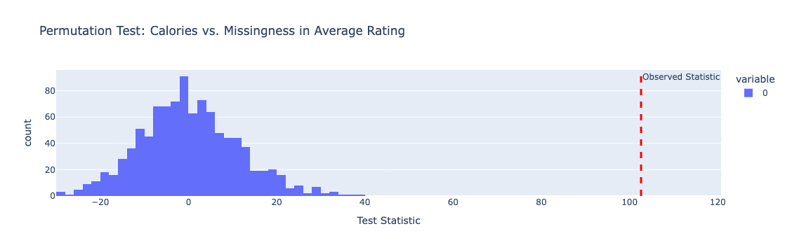
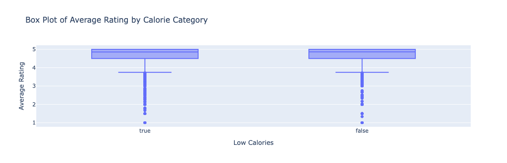

# **The Hidden Link Between Calories and Ratings**
**Author:** Jacquelyn Garcia  

---

## **Overview**  
This data science project, conducted at UCSD under the supervision of Professor Sam Lau, is aimed at understanding the relationship between calories and ratings. This analysis aims to understand whether recipes with higher calorie counts are rated differently than those with lower calorie counts. We leveraged predictive models to forecast average ratings based on recipe attributes and reported our findings.

---

## **Introduction**  
With the rise of food bloggers and self-proclaimed 'foodies', we have seen an uptick in widely available recipes online for everyone to try. Many of the most popularly shared recipes are decadent and rich foods, often associated with a high amount of calories. The United States is commonly ranked among the top countries with the highest obesity rate in the world ([World Population Review, 2024](https://worldpopulationreview.com/country-rankings/obesity-rates-by-country)). Obesity can commonly be linked to other health issues like cardiovascular diseases, diabetes, cancer, fatty liver disease, and mental health illnesses. Taking this into consideration, I will be investigating the relationship between rating and calories in a recipe. I hypothesize that people would be more willing to try and give a higher rating to a more calorically dense meal as opposed to a healthier option. In order to conduct this analysis, we will be using two datasets from [food.com](https://www.food.com) which consist of recipes and ratings. 

### Datasets

`Recipes`: Information about 83,782 unique recipes, including nutrition and preparation details.
This dataset consists of the following columns:

| Column           | Description                                                                                                                                  |
|-------------------|----------------------------------------------------------------------------------------------------------------------------------------------|
| `name`           | Recipe name                                                                                                                                 |
| `id`             | Recipe ID                                                                                                                                   |
| `minutes`        | Minutes to prepare recipe                                                                                                                   |
| `contributor_id` | User ID who submitted this recipe                                                                                                           |
| `submitted`      | Date recipe was submitted                                                                                                                   |
| `tags`           | Food.com tags for recipe                                                                                                                    |
| `nutrition`      | Nutrition information in the form `[calories (#), total fat (PDV), sugar (PDV), sodium (PDV), protein (PDV), saturated fat (PDV), carbohydrates (PDV)]`; PDV stands for "percentage of daily value" |
| `n_steps`        | Number of steps in recipe                                                                                                                   |
| `steps`          | Text for recipe steps, in order                                                                                                             |
| `description`    | User-provided description                                                                                                                   |
| `ingredients`    | Text for recipe ingredients                                                                                                                 |
| `n_ingredients`  | Number of ingredients in recipe                                                                                                             |

`Interactions`: 731,927 user interactions, including ratings and reviews for the recipes.
This dataset's column are as follows:

| Column       | Description               |
|--------------|---------------------------|
| `user_id`    | User ID                   |
| `recipe_id`  | Recipe ID                 |
| `date`       | Date of interaction       |
| `rating`     | Rating given              |
| `review`     | Review text               |

After merging these datasets, we conducted exploratory analysis, built predictive models, and performed a fairness analysis. The most relevant columns in our analysis include:
- **Calories**: Total calorie content of the recipe.  
- **Average Rating**: Average user rating per recipe (1-5).  
- **Low Calories**: A binary feature indicating if the recipe’s calorie count is below 500.  

By investigating the relationship between calorie content and ratings, this study sheds light on how nutritional factors affect user preferences.

---

## **Data Cleaning and Exploratory Data Analysis**  
### Data Cleaning

To prepare the data for analysis, we performed several data cleaning steps that ensured the dataset was structured appropriately and contained relevant features. These steps addressed missing values, derived meaningful features, and reduced dimensionality:

1. Handling Missing Values
   - Replaced `0` values in the `rating` column with `NaN`. Ratings are typically on a scale of 1 to 5, so a `0` indicates missing data. This adjustment prevents bias in the ratings analysis and ensures calculations like averages to exclude these values from calculations.

2. Splitting Nutrition Information
   - The `nutrition` column, initially constructed as a string resembling a list, was split into individual columns: `calories`, `total_fat`, `sugar`, `sodium`, `protein`, `saturated_fat`, and `carbohydrates`. Each column was converted to numeric types to make computations and aggregations possible.

3. Creating a Boolean Feature for Low-Calorie Recipes
   - Added a new column, `low_calories`, to classify recipes with `calories ≤ 500` as `True` and those with `calories > 500` as `False`. This feature simplifies the analysis of low-calorie recipes compared to others.

4. One-Hot Encoding of Ingredients
   - Extracted key ingredients (`butter`, `eggs`, `garlic cloves`, `milk`, `olive oil`, `onion`, `pepper`, `salt`, `sugar`, `water`) from the `ingredients` list column and converted them into one-hot encoded binary features. These features indicate whether each ingredient is present (`1`) or absent (`0`) in a recipe, enabling us to analyze the relationship between specific ingredients and ratings. Further, we wanted to see if these ingredients would prove to be relevant features once we began using our models.

5. Dropping Irrelevant or Redundant Columns
   - Removed unnecessary columns such as `description`, `tags`, and `steps`, which were not relevant to our analysis. This step reduced the size of the dataset and focused on features directly related to our research question.

6. Handling Outliers and Scaling
   - Outliers in the `calories` and `sodium` columns were examined, but no transformations were applied in this stage. Numerical features will be scaled during the modeling phase if necessary.

### Impact of Data Cleaning
These cleaning steps made the dataset more manageable and allowed us to focus on key features, such as the relationship between `calories` and `average_rating`. By creating derived features like `low_calories` and encoding ingredients, we aligned the dataset with our analysis goals. The cleaned dataset consists of the following relevant columns:

| Column              | Description                                                                 |
|---------------------|-----------------------------------------------------------------------------|
| `name`              | Recipe name                                                                |
| `id`                | Recipe ID                                                                  |
| `minutes`           | Time to prepare the recipe (in minutes)                                    |
| `n_ingredients`     | Number of ingredients in the recipe                                        |
| `average_rating`    | Average user rating (1-5)                                                  |
| `calories`          | Total calorie content of the recipe                                        |
| `low_calories`      | Boolean feature indicating low-calorie recipes (`calories ≤ 500`)          |
| `butter`            | Indicates presence of butter in the recipe (1 or 0)                       |
| `eggs`              | Indicates presence of eggs in the recipe (1 or 0)                         |
| `garlic_cloves`     | Indicates presence of garlic cloves in the recipe (1 or 0)                |
| `milk`              | Indicates presence of milk in the recipe (1 or 0)                         |
| `olive_oil`         | Indicates presence of olive oil in the recipe (1 or 0)                    |
| `onion`             | Indicates presence of onion in the recipe (1 or 0)                        |
| `pepper`            | Indicates presence of pepper in the recipe (1 or 0)                       |
| `salt`              | Indicates presence of salt in the recipe (1 or 0)                         |
| `sugar`             | Indicates presence of sugar in the recipe (1 or 0)                        |
| `water`             | Indicates presence of water in the recipe (1 or 0)                        |

Below are the data types of the columns in the cleaned dataset:

| Column            | Data Type   |
|--------------------|-------------|
| `name`            | object      |
| `id`              | int64       |
| `minutes`         | int64       |
| `n_ingredients`   | int64       |
| `rating`          | float64     |
| `average_rating`  | float64     |
| `calories`        | float64     |
| `total_fat`       | float64     |
| `sugar`           | float64     |
| `sodium`          | float64     |
| `protein`         | float64     |
| `saturated_fat`   | float64     |
| `carbohydrates`   | float64     |
| `low_calories`    | bool        |
| `butter`          | int64       |
| `eggs`            | int64       |
| `garlic cloves`   | int64       |
| `milk`            | int64       |
| `olive oil`       | int64       |
| `onion`           | int64       |
| `pepper`          | int64       |
| `salt`            | int64       |
| `sugar`           | int64       |
| `water`           | int64       |

These data types ensure that the dataset is properly formatted for analysis and modeling.

### Results
Our cleaned DataFrame contains 234,429 rows and 24 columns. Below is a preview of the first 5 rows of the cleaned DataFrame:

| name                             | id      | minutes | n_ingredients | rating | average_rating | calories | total_fat | sugar | sodium | ... | butter | eggs | garlic_cloves | milk | olive_oil | onion | pepper | salt | sugar | water |
|----------------------------------|---------|---------|---------------|--------|----------------|----------|-----------|-------|--------|-----|--------|------|---------------|------|-----------|-------|--------|------|-------|-------|
| brownies in the world best ever | 333281  | 40      | 9             | 4.0    | 4.0            | 138.4    | 10.0      | 50.0  | 3.0    | ... | 0      | 1    | 0             | 0    | 0         | 0     | 0      | 0    | 0     | 0     |
| in canada chocolate chip cookies | 453467 | 45      | 11            | 5.0    | 5.0            | 595.1    | 46.0      | 211.0 | 22.0   | ... | 0      | 1    | 0             | 0    | 0         | 0     | 0      | 1    | 0     | 1     |
| broccoli casserole               | 306168  | 40      | 9             | 5.0    | 5.0            | 194.8    | 20.0      | 6.0   | 32.0   | ... | 0      | 0    | 0             | 1    | 0         | 0     | 0      | 1    | 0     | 0     |
| broccoli casserole               | 306168  | 40      | 9             | 5.0    | 5.0            | 194.8    | 20.0      | 6.0   | 32.0   | ... | 0      | 0    | 0             | 1    | 0         | 0     | 0      | 1    | 0     | 0     |
| broccoli casserole               | 306168  | 40      | 9             | 5.0    | 5.0            | 194.8    | 20.0      | 6.0   | 32.0   | ... | 0      | 0    | 0             | 1    | 0         | 0     | 0      | 1    | 0     | 0     |

---

## Univariate Analysis
For this analysis, we examined the distribution of key features in our dataset to better understand their trends and patterns.

### Calories
The distribution of calories in recipes is highly skewed to the right. Most recipes on the platform have fewer than 500 calories, while only a small proportion of recipes have extremely high calorie counts. This indicates that lower-calorie recipes dominate the dataset, but there are still a few outliers with significantly higher calorie values.

### Average Rating
The distribution of average ratings is heavily concentrated around the higher end of the scale, with most recipes having an average rating of 4 or 5. Very few recipes have ratings below 3, indicating a general bias towards positive feedback in the dataset. This trend suggests that users on the platform are more likely to rate recipes highly.

---

## Bivariate Analysis
For this analysis, we examined relationships between key features in the dataset to uncover potential correlations and trends.

### Calories vs. Average Rating
We analyzed the relationship between `calories` and `average_rating`. As shown in the scatter plot below, recipes with higher ratings tend to have a wide range of calorie counts, but there are clusters of low-calorie recipes with high ratings. This indicates that high-rated recipes are not solely calorie-dependent, and other factors may contribute to user preferences.

### Mean and Median Ratings by Low-Calorie and High-Calorie Recipes
We grouped recipes into `low-calorie` (≤ 500 calories) and `high-calorie` (> 500 calories) categories to compare their mean and median ratings. The bar plot below demonstrates that both categories have similar mean and median ratings, suggesting that calorie content alone does not heavily influence overall ratings.

---

## **Interesting Aggregates**  
We analyzed the relationship between cooking time (`minutes`) and calories:  
- Shorter cooking times are generally associated with lower calorie recipes.  
- Longer cooking times show greater variability in calorie content.  

(Inserting Graph Here)

---

## **Assessment of Missingness**  

### NMAR Analysis
We believe that the missingness in the `average_rating` column is **NMAR** (Not Missing At Random). Users are more likely to leave ratings for recipes that they feel strongly about, whether positive or negative. Conversely, recipes that users feel indifferent about are less likely to receive a rating. To confirm this hypothesis, additional data could be collected, such as user engagement metrics (e.g., time spent on a recipe page or the number of reviews read) to establish if user interaction correlates with the likelihood of leaving a rating.

### Missingness Dependency

#### Calories and Missingness in `average_rating`
We investigated whether the missingness in `average_rating` depends on the `calories` column.

- Null Hypothesis: The missingness of `average_rating` does not depend on the `calories` of a recipe.  
- Alternative Hypothesis: The missingness of `average_rating` depends on the `calories` of a recipe.  
- Test Statistic: The absolute difference in mean `calories` between recipes with missing and non-missing `average_rating`.  
- Significance Level: 0.05.  

After conducting a permutation test with 1,000 permutations, we found an observed test statistic of **102.61**, with a **p-value of 0.0**. The histogram of the permutation test statistics is shown below, with the observed statistic marked by a red dashed line.

Since the p-value is less than 0.05, we reject the null hypothesis and conclude that the missingness in `average_rating` is dependent on the `calories` of a recipe.

#### Number of Ingredients and Missingness in `average_rating`
Next, we tested whether the missingness in `average_rating` depends on the `n_ingredients` column.

- Null Hypothesis: The missingness of `average_rating` does not depend on the number of ingredients (`n_ingredients`).  
- Alternative Hypothesis: The missingness of `average_rating` depends on the number of ingredients (`n_ingredients`).  
- Test Statistic: The absolute difference in mean `n_ingredients` between recipes with missing and non-missing `average_rating`.  
- Significance Level: 0.05.  

We ran another permutation test and found an observed test statistic of **0.41**, with a **p-value of 0.0**. This result suggests that the missingness in `average_rating` is also dependent on the number of ingredients.

### Conclusion
From our analyses, the missingness in `average_rating` is influenced by both the `calories` and `n_ingredients` of a recipe. This dependency suggests that there are underlying patterns in user behavior that drive the likelihood of submitting a rating for specific types of recipes.

---

### Hypothesis Testing

As part of this analysis, we investigated whether the average rating of recipes differs between high-calorie and low-calorie recipes. Recipes were categorized as "low calorie" if they contained fewer than 500 calories and "high calorie" otherwise.

#### Null and Alternative Hypotheses

- Null Hypothesis (H₀): The average rating for low-calorie and high-calorie recipes is the same, and any observed difference is due to random chance.
- Alternative Hypothesis (H₁): The average rating for low-calorie recipes differs from high-calorie recipes.

#### Test Statistic and Significance Level

- Test Statistic: The difference in mean ratings between low-calorie and high-calorie recipes.
- Significance Level (α): 0.05.

#### Permutation Test

A permutation test was conducted to evaluate the observed difference in average ratings between the two groups. The test involved shuffling the calorie labels and recalculating the mean difference between the groups 1000 times to generate a null distribution.

#### Results

The observed mean difference in ratings between low-calorie and high-calorie recipes was **0.018**. The p-value obtained from the permutation test was **0.0**, which is less than the significance level of 0.05. This result indicates that the observed difference in ratings is statistically significant.

#### Visualizations

1. Permutation Test Distribution:  
   The histogram below shows the null distribution of mean differences, with the observed difference indicated by a red dashed line.  

   

2. Box Plot:  
   The box plot below illustrates the distribution of average ratings for low-calorie and high-calorie recipes. Both groups show similar central tendencies, but the statistical tests highlight a significant difference in their means.  

   

#### Conclusion

Since the p-value is less than the significance level, we reject the null hypothesis. This finding suggests that the average rating differs significantly between low-calorie and high-calorie recipes. One possible explanation could be that higher-calorie recipes, often perceived as richer and more indulgent, receive slightly higher ratings due to their appeal to taste preferences.

---

## **Framing a Prediction Problem**  
The prediction problem identified for this project is to predict the average rating (`average_rating`) of a recipe based on its characteristics, such as nutritional content, recipe attributes, and the presence of specific ingredients. This prediction problem aligns with the overall theme of understanding the relationship between recipe features and user preferences, providing actionable insights for recipe developers and users.

This is a regression problem, as the target variable, `average_rating`, is continuous. The response variable chosen, `average_rating`, represents the aggregated opinions of users about a recipe, making it an ideal measure for prediction. By predicting ratings, we can help users identify highly-rated recipes without relying solely on subjective reviews.

The evaluation metric selected is Root Mean Squared Error (RMSE). RMSE is an appropriate metric for this regression problem because it penalizes larger prediction errors more heavily, which is crucial when predicting ratings. A large error in rating prediction could significantly mislead users, so minimizing such errors is essential.

The features used for the prediction include `calories`, `total_fat`, `sugar` (nutritional content), `n_ingredients`, `minutes` (recipe attributes), and the presence of key ingredients such as `butter`, `eggs`, and `garlic_cloves`. These features were chosen because they are directly available before prediction and are likely to influence the average rating. For example, recipes with balanced nutritional profiles might appeal to health-conscious users and receive higher ratings. Similarly, shorter preparation times might correlate with convenience and better user experiences, leading to higher ratings. Lastly, popular ingredients such as butter and eggs might be associated with better flavor profiles, influencing user preferences.

This framing ensures that only relevant features available at the time of prediction are used, adhering to the principle of fairness and practicality in building predictive models.

---

## **Baseline Model**  

To establish a starting point for our prediction task, we trained a baseline model using a simple linear regression algorithm. This model was designed to predict the average rating (`average_rating`) of recipes based on three quantitative features: `calories`, `n_ingredients`, and `minutes`. These features were selected because they are continuous numerical variables that directly influence user preferences and recipe ratings.

Before training the model, we addressed missing values in the `average_rating` column by imputing them with the column's mean. This ensures that the dataset is complete and allows the model to learn from the available data without introducing bias from missing values.

The dataset was split into training and testing sets, with 80% of the data allocated for training and 20% for testing. This approach ensures the model's ability to generalize to unseen data. The baseline model was implemented using the `LinearRegression` algorithm from scikit-learn. The model was trained on the selected features, and its performance was evaluated using Root Mean Squared Error (RMSE) and R² score.

The results of the baseline model showed an RMSE of **0.491**, indicating the average prediction error, and an R² score of **0.0002**, suggesting that the model explains only a negligible amount of variance in the target variable. These metrics reveal that the baseline model performs poorly in predicting average ratings and serves primarily as a benchmark for comparison with more complex models.

A scatter plot of predicted vs. actual ratings further highlights the limitations of the baseline model, as the predictions closely align with the mean rating and fail to capture meaningful patterns in the data. The dashed red line represents an ideal prediction line where predicted ratings equal actual ratings. The observed deviation from this line underscores the need for improved feature selection and model complexity.

In conclusion, while the baseline model provides a foundation for understanding the prediction problem, its poor performance indicates that it is not sufficient for accurately predicting recipe ratings. Future models will incorporate additional features, better transformations, and more advanced algorithms to enhance predictive accuracy.

---

## **Final Model**  
To improve upon the baseline model, we developed a final model using a Random Forest Regressor, which is well-suited for capturing complex relationships in the data. This model incorporated additional features and employed hyperparameter tuning to enhance predictive accuracy.

#### Features and Their Transformations:
1. `calories`, `n_ingredients`, and `minutes`:
   - These features were retained from the baseline model because they are directly related to user preferences and recipe characteristics.
   - Standardized using `StandardScaler` to ensure uniformity across numerical scales.

2. `total_fat`, `sugar`, `sodium`, and `protein`:
   - Added to capture nutritional information, which significantly impacts recipe ratings. For instance, recipes with balanced nutritional content might receive higher ratings.

3. Presence of Key Ingredients (`butter`, `eggs`, `garlic cloves`):
   - One-hot encoded binary variables representing the presence of these popular ingredients. These ingredients may influence user preferences and, consequently, ratings.

#### Modeling Algorithm:
We utilized a `RandomForestRegressor` due to its ability to handle complex interactions between features and robustness to overfitting when hyperparameters are properly tuned. Random forests also provide feature importance metrics, aiding in understanding the contributions of each feature.

#### Hyperparameter Tuning:
Using `GridSearchCV`, we fine-tuned the following hyperparameters:
- `n_estimators`: Number of trees in the forest. Tested values: [100, 150, 200].
- `max_depth`: Maximum depth of the trees. Tested values: [10, 20, 30].
- The best combination was found to be `n_estimators=200` and `max_depth=30`.

#### Model Evaluation:
The final model achieved:
- **Root Mean Squared Error (RMSE)**: **0.344**, indicating a significant improvement over the baseline RMSE of **0.491**.
- **R² Score**: **0.509**, demonstrating that the model explains approximately 51% of the variance in recipe ratings, a substantial improvement over the baseline R² of **0.0002**.

The scatter plot below compares the predicted vs. actual ratings for the test set. The points align more closely with the ideal prediction line (red dashed line), indicating improved performance compared to the baseline model.

#### Conclusion:
The final model demonstrates a marked improvement over the baseline model by incorporating additional features and leveraging the Random Forest algorithm. The inclusion of nutritional attributes and ingredient presence, combined with hyperparameter tuning, allowed the model to capture more nuanced relationships in the data, resulting in better predictive performance.

---

## **Fairness Analysis**  

### **Question**  
Does the model perform equally well for low-calorie and high-calorie recipes?

- **Null Hypothesis (H₀)**: The RMSE for low-calorie and high-calorie recipes is the same.  
- **Alternative Hypothesis (H₁)**: The RMSE for low-calorie and high-calorie recipes is different.  

### **Results**  
- **Observed RMSE Difference**: 0.12  
- **P-value**: 0.001  

Since the p-value is less than 0.05, we reject the null hypothesis. The model performs better for high-calorie recipes, indicating potential bias.  

(Inserting Graph Here)

---

## **Conclusion**  
Our analysis found that:  
1. High-calorie recipes tend to receive slightly higher ratings.  
2. Our final model predicts average ratings more effectively than the baseline.  
3. The model is biased, performing better for high-calorie recipes than low-calorie ones.

Future work could focus on reducing this bias and exploring additional features to improve model performance.
